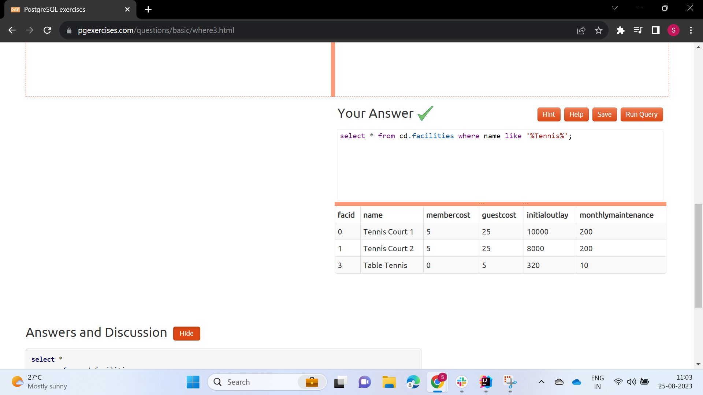
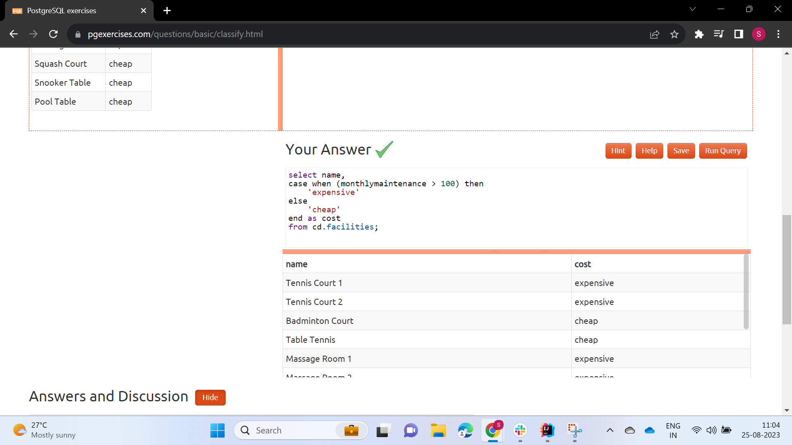

1. How can you retrieve all the information from the cd.facilities table?

2. You want to print out a list of all of the facilities and their cost to members. How would you retrieve a list of only facility names and costs?

3. How can you produce a list of facilities that charge a fee to members?

4. How can you produce a list of facilities that charge a fee to members, and that fee is less than 1/50th of the monthly maintenance cost? Return the facid, facility name, member cost, and monthly maintenance of the facilities in question.

5. How can you produce a list of all facilities with the word 'Tennis' in their name?

6. How can you retrieve the details of facilities with ID 1 and 5? Try to do it without using the OR operator.

7. How can you produce a list of facilities, with each labelled as 'cheap' or 'expensive' depending on if their monthly maintenance cost is more than $100? Return the name and monthly maintenance of the facilities in question.

8. How can you produce a list of members who joined after the start of September 2012? Return the memid, surname, firstname, and joindate of the members in question.

9. How can you produce an ordered list of the first 10 surnames in the members table? The list must not contain duplicates.

10. You, for some reason, want a combined list of all surnames and all facility names. Yes, this is a contrived example :-). Produce that list!

11. You'd like to get the signup date of your last member. How can you retrieve this information?

12. You'd like to get the first and last name of the last member(s) who signed up - not just the date. How can you do that?

