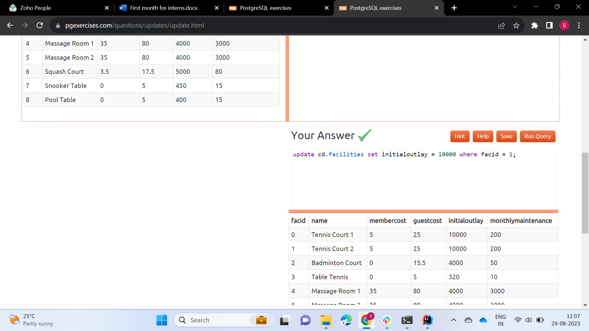
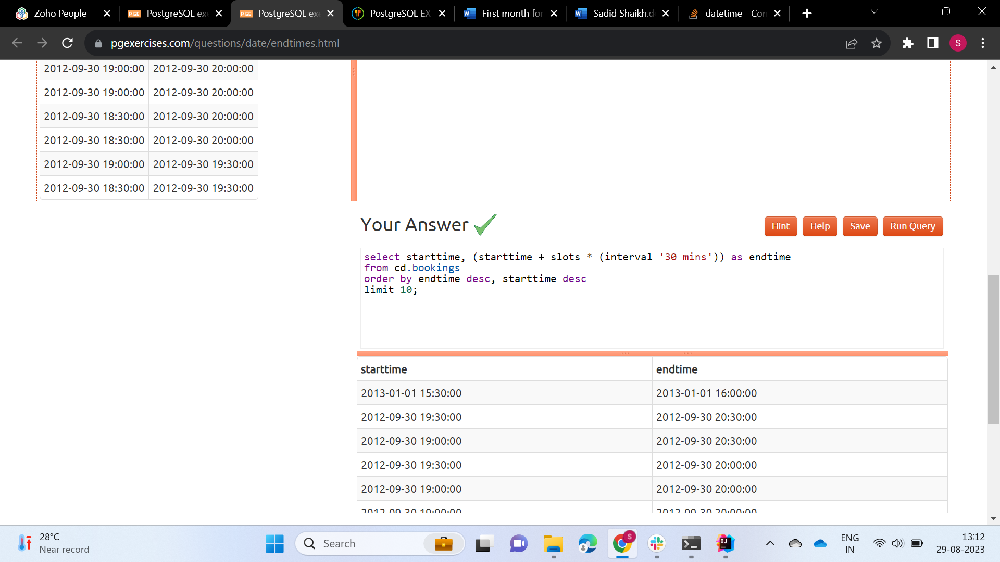

# Modifying Data

1. The club is adding a new facility - a spa. We need to add it into the facilities table. Use the following values:

2. In the previous exercise, you learned how to add a facility. Now you're going to add multiple facilities in one
   command. Use the following values:

3. Let's try adding the spa to the facilities table again. This time, though, we want to automatically generate the
   value for the next facid, rather than specifying it as a constant. Use the following values for everything else:

4. We made a mistake when entering the data for the second tennis court. The initial outlay was 10000 rather than 8000:
   you need to alter the data to fix the error.

5. We want to increase the price of the tennis courts for both members and guests. Update the costs to be 6 for members,
   and 30 for guests.

6. We want to alter the price of the second tennis court so that it costs 10% more than the first one. Try to do this
   without using constant values for the prices, so that we can reuse the statement if we want to.

7. As part of a clearout of our database, we want to delete all bookings from the cd.bookings table. How can we
   accomplish this?

8. We want to remove member 37, who has never made a booking, from our database. How can we achieve that?

9. In our previous exercises, we deleted a specific member who had never made a booking. How can we make that more
   general, to delete all members who have never made a booking?

# String Operations

1. Output the names of all members, formatted as 'Surname, Firstname'

2. Find all facilities whose name begins with 'Tennis'. Retrieve all columns.

3. Perform a case-insensitive search to find all facilities whose name begins with 'tennis'. Retrieve all columns.

4. You've noticed that the club's member table has telephone numbers with very inconsistent formatting. You'd like to
   find all the telephone numbers that contain parentheses, returning the member ID and telephone number sorted by
   member ID.

5. The zip codes in our example dataset have had leading zeroes removed from them by virtue of being stored as a numeric
   type. Retrieve all zip codes from the members table, padding any zip codes less than 5 characters long with leading
   zeroes. Order by the new zip code.

6. You'd like to produce a count of how many members you have whose surname starts with each letter of the alphabet.
   Sort by the letter, and don't worry about printing out a letter if the count is 0.

7. The telephone numbers in the database are very inconsistently formatted. You'd like to print a list of member ids and
   numbers that have had '-','(',')', and ' ' characters removed. Order by member id.

# Working with Timestamps

1. Produce a timestamp for 1 a.m. on the 31st of August 2012.

2. Find the result of subtracting the timestamp '2012-07-30 01:00:00' from the timestamp '2012-08-31 01:00:00'

3. Produce a list of all the dates in October 2012. They can be output as a timestamp (with time set to midnight) or a
   date.

4. Get the day of the month from the timestamp '2012-08-31' as an integer.

5. Work out the number of seconds between the timestamps '2012-08-31 01:00:00' and '2012-09-02 00:00:00'

6. For each month of the year in 2012, output the number of days in that month. Format the output as an integer column
   containing the month of the year, and a second column containing an interval data type.

7. For any given timestamp, work out the number of days remaining in the month. The current day should count as a whole
   day, regardless of the time. Use '2012-02-11 01:00:00' as an example timestamp for the purposes of making the answer.
   Format the output as a single interval value.

8. Return a list of the start and end time of the last 10 bookings (ordered by the time at which they end, followed by
   the time at which they start) in the system.

9. Return a count of bookings for each month, sorted by month

